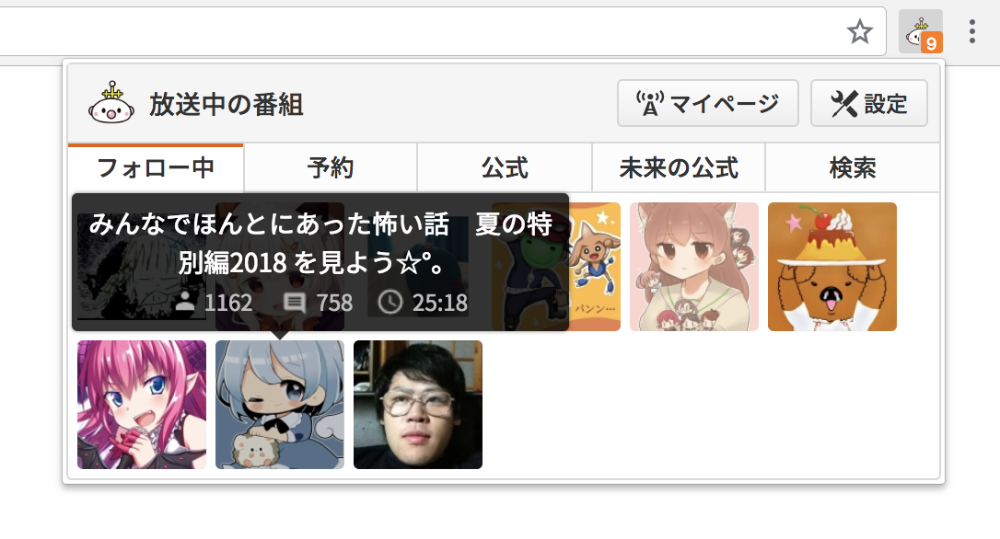
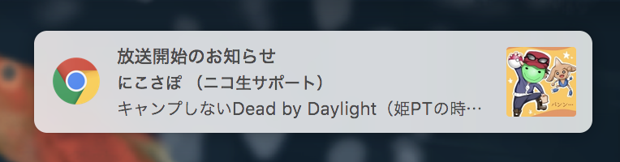
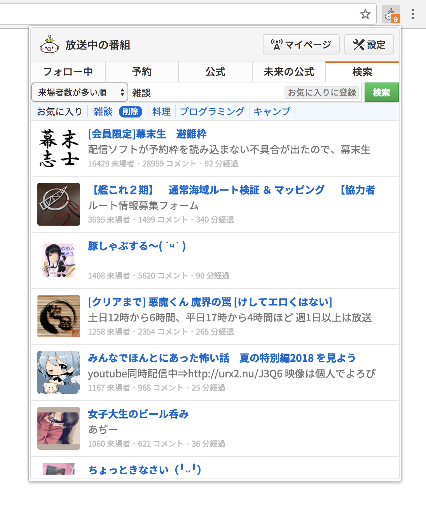
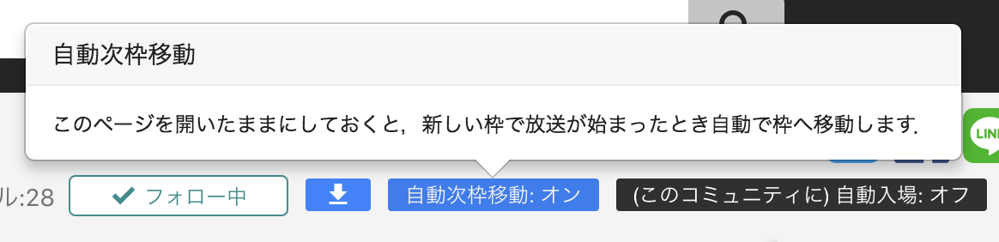
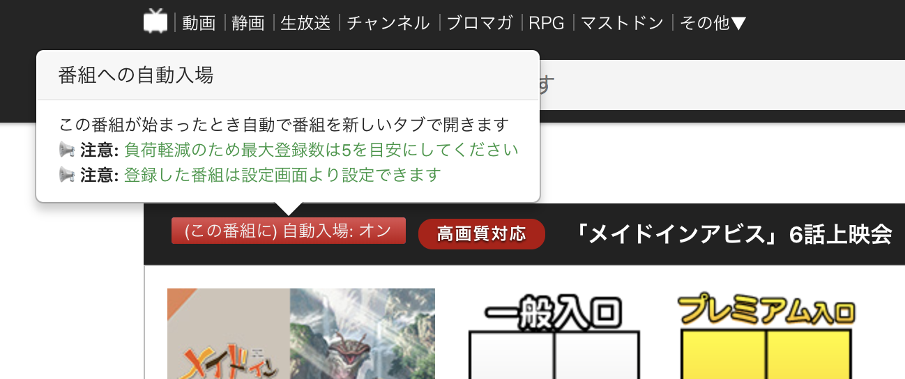
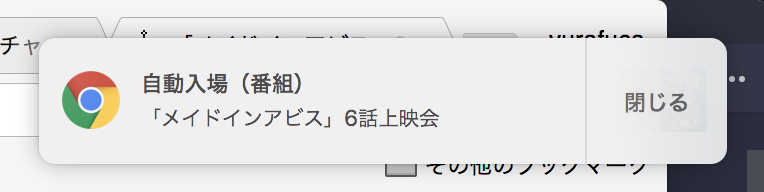
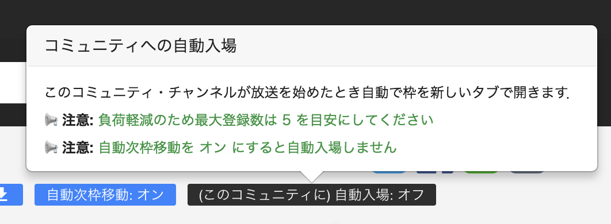
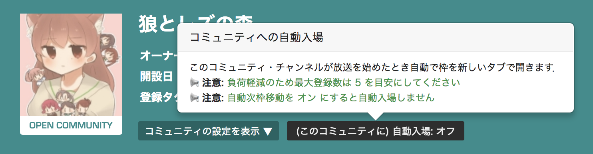
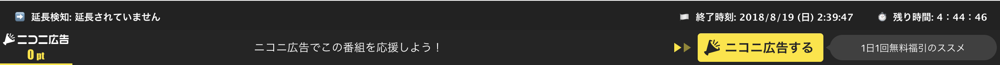
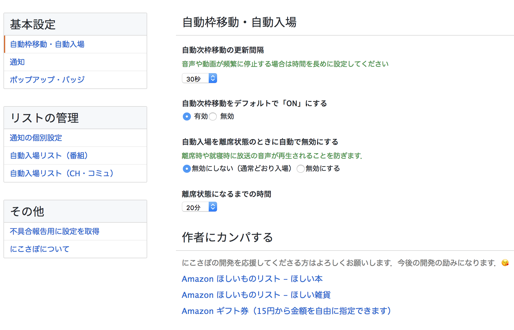

<p align="center">
  
</p>

<p align="center">
  Raise the stage of NicoLive experience one step.
</p>

---

# What is this

にこさぽはニコニコ生放送の視聴を支援する Google Chrome Extension です．

# Install

[にこさぽ - Chrome WebStore](https://chrome.google.com/webstore/detail/%E3%83%8B%E3%82%B3%E7%94%9F%E3%83%81%E3%82%A7%E3%83%83%E3%82%AB%E3%83%BC/kfnogdokhemdbbclknmmjpcnmjmpjknc)

# How to Build

```
yarn run build
```

# Features

1. 放送中 / 放送予定 の番組を一覧表示
1. デスクトップ通知
1. 放送中の番組を検索
1. 自動枠移動
1. 自動入場
1. 通知バー（残り時間・終了時刻の表示，延長通知）

## 放送中の番組一覧を表示



ツールバーに追加されるにこさぽのアイコンをクリックすると，フォローしているコミュニティ・チャンネルの放送番組を一覧表示します．サムネイルにマウスオーバーすると番組の説明が表示されます．

ポップアップ上部のタブをクリックすると，ポップアップに表示されるコンテンツを切り替えられます．

| タブ | 説明 |
| --- | --- |
| フォロー中 | フォロー中のコミュニティ・チャンネルが放送中の番組を一覧表示します |
| 予約 | フォロー中のコミュニティ・チャンネルが予約中の番組を一覧表示します |
| 公式 | ユーザチャンネル・公式チャンネルが放送中の番組を一覧表示します |
| 未来 | ユーザチャンネル・公式チャンネルが予約中の番組を一覧表示します |
| 検索 | 放送中の番組を検索します |

アイコンには放送中のフォロー中タブのアイテムの数がオレンジ色のバッジとして表示されます．

> **NOTE:** 放送中の番組数が 0 のときのバッジの表示の有無をオプションから設定できます．

## デスクトップ通知

フォロー中のコミュニティ・チャンネルが放送を開始すると，にこさぽは通知音を再生しデスクトップ通知を表示します．通知の有無や音量をオプションから設定できます．



## 放送中の番組を検索



ポップアップの上部のタブから **検索** タブをクリックすると放送中の番組を検索できます．

**お気に入りに登録** ボタンをクリックすると検索ボックスに入力したキーワードをお気に入りに登録できます．お気に入りに登録されたキーワードは検索ボックスの下の水色の領域に常に表示されるようになります．登録されたキーワードをクリックするとキーボードを叩かずに番組を検索できます．

## 自動次枠移動



にこさぽをインストールすると放送ページに自動次枠移動の有効・無効を切り替えるボタンが表示されます．「自動次枠移動ON」の状態では自動次枠移動が有効になります．「自動次枠移動OFF」の状態では自動次枠移動が無効になります．

放送用ページを開き続けておくと，その間にこさぽは当該コミュニティが新しく放送を開始していないかを一定時間ごとにチェックします．新しい番組が始まったことを検知すると，にこさぽはその番組を自動的に開きます．

> **NOTE:** 自動枠移動の更新間隔はオプションから設定できます．

> **NOTE:** 自動次枠移動の有効/無効設定はタブごとに保存されます．コミュニティやチャンネルごとには保存されません．そのため，新しく放送用ページを開くと必ずボタンの状態は後述の**設定画面**で設定した状態になります．

> **NOTE:** 新しく放送が開始されているかを確認するのに時間制限はありません．放送用ページを開いている間はチェックを継続します．

> **NOTE:** 自動枠移動は最大数十秒のラグが発生します．

## 自動入場

自動入場は次の二種類に大別できます．

1. **番組** への自動入場
2. **コミュニティ / チャンネル** への自動入場

### 番組への自動入場



にこさぽインストールするとゲートページに自動入場の有効/無効を切り替えるボタンが表示されます．「自動入場ON」の状態では自動入場が有効になり，にこさぽ内部の自動入場リストに当該番組が登録されます．「自動入場OFF」の状態では自動入場が無効になり，自動入場リストから当該番組が削除されます．

Google Chrome が起動している間，にこさぽは自動入場リストの中から放送が始まった番組を一定時間ごとにチェックします．放送が始まった番組を検知すると，にこさぽはその番組を自動的に新しいタブで開きます
．新しいタブを開くときにこさぽは通知を表示します．



> **NOTE:** 新しいタブが開かれると同時に当該番組は自動入場リストから自動的に削除されます．

> **NOTE:** 自動入場リストの管理はオプションからおこなえます

### コミュニティ・チャンネルへの自動入場




インストールすると，次のページに新たにボタンが追加されます．

+ 放送ページ
+ コミュニティのトップページ

ボタンをクリックすると，システム内部のコミュニティ・チャンネルへの自動入場リストに，当該のコミュニティ・チャンネルが登録されます．自動入場リストは設定画面から管理できます．

にこさぽは一定時間ごとに，自動入場リストに登録されたコミュニティ・チャンネルが放送を開始したか確認します．放送が開始された場合はその放送を新しいタブで開きます．新しいタブを開くときにこさぽは通知を表示します．

## 通知バー



プレイヤー上部に通知バーが表示されます．通知バーには次が表示されます．

| 表示される情報 | 説明 |
| --- | --- |
| 通知検知 | 番組が延長されたとき「放送が～に延長されました」とメッセージが表示されます |
| 終了時刻 | 番組が終了する時刻です |
| 残り時間 | 番組の残り時間です |

## 設定画面

インストール後にツールバーに追加されるアイコンを右クリック->設定 から，にこさぽの設定をおこなえます．


